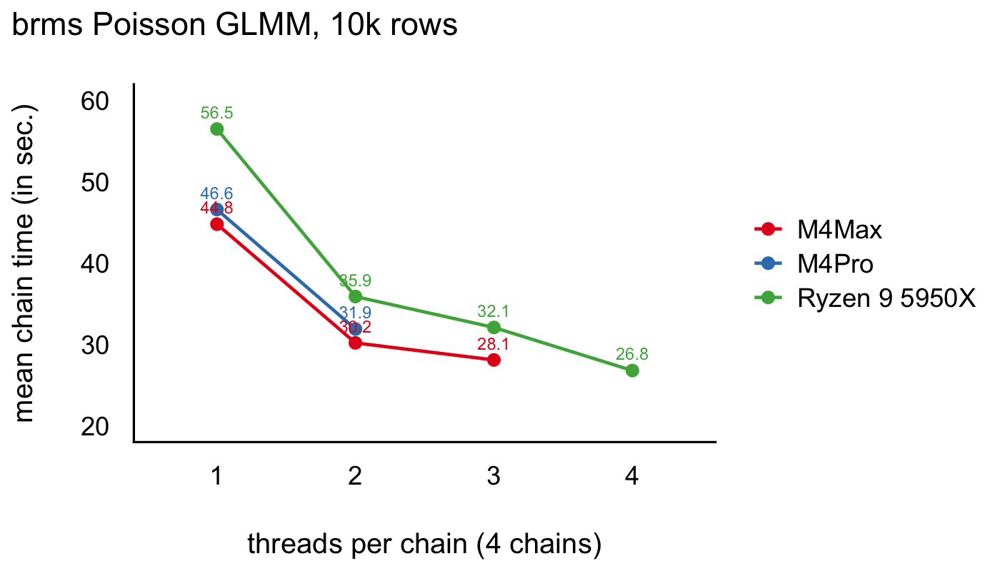

<!-- README.md is generated from README.Rmd. Please edit that file -->

## The benchmark

The data is synthetic and basically a modified version of those
published here. It has a 10.000
<https://cran.r-project.org/web/packages/brms/vignettes/brms_threading.html>

The model in the benchmark is a simple Poisson MLM model with two
predictors and clustering (random intercept and fixed slopes). It uses
4000 iterations with the first 2000 being warmup. The model assumes that
the machine has at least 4 cores and will spawn 4 chains, one for each
core.

The threads argument sets the number of within-chain threads per chain.
At threads = 1, each MCMC chain runs on a single core (and 4 cores in
total). At threads = 2, each chain’s likelihood is split across 2
threads, so in total 4 x 2 = 8 cores are used. At threads = 3 it 12
cores, and so on. As a note, keep 4 x threads at or below the number of
available (fast, if performance cores) physical cores.

``` r
model_poisson <- brm(
    y ~ 1 + x1 + x2 + (1 | g),
    data = benchmark,
    family = poisson(),
    iter = 4000,
    warmup = 2000,
    chains = 4,
    cores = 4,
    threads = if (threads > 1) threading(threads) else NULL,
    seed = 1234,
    prior = prior(normal(0, 1), class = b) +
      prior(constant(1), class = sd, group = g),
    backend = "cmdstanr",
    save_pars = save_pars(all = TRUE)
  )
```

## Results

| machine       | 1 thread |      2 threads |      3 threads |      4 threads |
|:--------------|---------:|---------------:|---------------:|---------------:|
| Ryzen 9 5950X |   56.5 s | 35.9 s (1.57×) | 32.1 s (1.76×) | 26.8 s (2.11×) |
| M4Pro         |   46.6 s | 31.9 s (1.46×) |             NA |             NA |
| M4Max         |   44.8 s | 30.2 s (1.48×) | 28.1 s (1.59×) |             NA |

Mean chain time (speed-up vs 1 thread)

## The graph

<!-- -->
