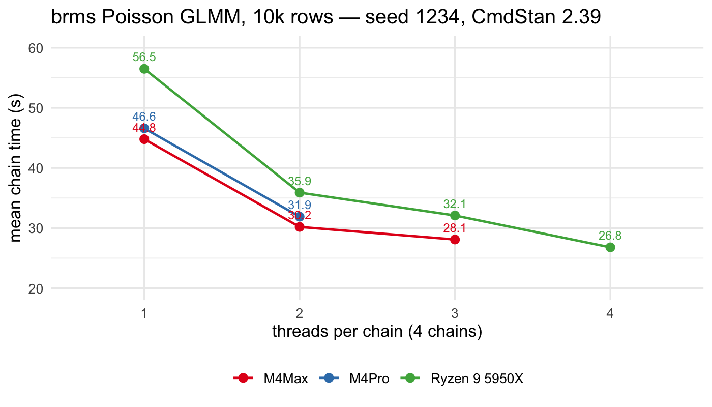

<!-- README.md is generated from README.Rmd. Please edit that file -->

## The cmdstan/brms/cpu benchmark

## Results so far

Results…

| machine       | threads=1 | threads=2 | threads=3 | threads=4 |
|:--------------|----------:|----------:|----------:|----------:|
| M4Max         |      44.8 |      30.2 |      28.1 |        NA |
| M4Pro         |      46.6 |      31.9 |        NA |        NA |
| Ryzen 9 5950X |      56.5 |      35.9 |      32.1 |      26.8 |

And the graph…

<!-- -->
