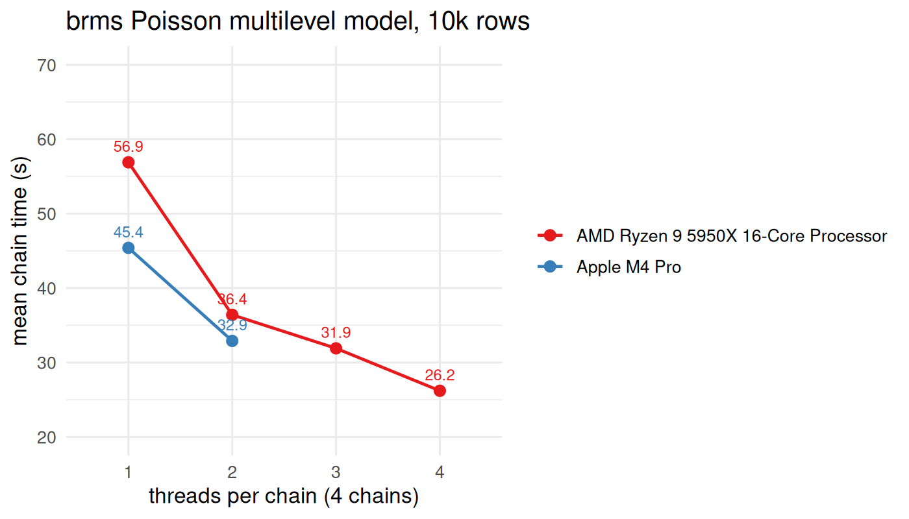

<!-- README.md is generated from README.Rmd. Please edit that file -->

# `brms` CPU benchmark

This repo contains a small, reproducible benchmark for how fast a modern
computer samples a typical psychology model with **brms / CmdStan**,
with wall time as a user experiences it, with and without within-chain
threading, though the times obtained with threading are of interest.

I do not recommend running it under “pure” Windows. For example, in this
dataset, the 5625U from AMD reported timings of 286s for 4 chains X 1
thread and the same laptop under WSL2 and under the same settings,
89.8s. So the biggest available free lunch for a Windows user in terms
of speeding up is using the WSL. I have observed this a lot and there
are enough [threads on the
interwebs](https://discourse.mc-stan.org/t/large-cmdstan-performance-differences-windows-vs-linux/14415/30)
with concurring evidence. I am not sure if the reason for this issue was
ever clarified but alas, here we are.

## How to run it

Copy/paste into the console, but beware of your own specs before setting
the treads argument.

``` r
source("https://raw.githubusercontent.com/GGLuca/brms-cpu-benchmark/refs/heads/master/benchmark.R")
run_benchmark(threads = 1:2, reps = 2)   # keep 4 x threads <= your fast physical cores
```

Needs R, `brms`, `cmdstanr` and a working CmdStan
(`cmdstanr::install_cmdstan()`). Each run appends one row to
`results.csv` in your working directory and prints it. The first run of
each thread setting includes compilation (visible in `overhead`). The
second is the clean one and will most likely give the lowest timing.
Laptops should be plugged in if on Win, and on Linux, set the CPU
governor to *performance*.

## Report it

If you wish, paste your rows as a [GitHub
issue](https://github.com/GGLuca/brms-cpu-benchmark/issues) and also
please make sure that the laptop was plugged in and if the power mode
was on (if on Win). If you are on Linux, which governor was active. Rows
are merged into `results.csv` by me as soon as I get the chance.

## The benchmark

The function uses synthetic data, which is a modified version of the
data in the [within-chain parallelization
vignette](https://cran.r-project.org/web/packages/brms/vignettes/brms_threading.html)
(Weber & Bürkner, 2025). It has 10,000 observations clustered in 1,000
groups.

The model is a simple Poisson multilevel model with two predictors and
clustering (random intercept, fixed slopes), also from the vignette. It
uses 4,000 iterations per chain, the first 2,000 being warmup. The
benchmark assumes at least 4 physical cores and runs 4 chains in
parallel, 1/core as a default.

The `brm()` call inside `run_benchmark()`:

``` r
brm(
  y ~ 1 + x1 + x2 + (1 | g),
  data = benchmark, family = poisson(),
  iter = 4000, warmup = 2000,
  chains = 4, cores = 4,
  threads = if (k > 1) threading(k) else NULL,
  seed = 1234,
  prior = prior(normal(0, 1), class = b) +
          prior(constant(1), class = sd, group = g),
  backend = "cmdstanr",
  save_pars = save_pars(all = TRUE)
)
```

## Arguments

- The `threads` argument sets the number of within-chain threads per
  chain. At `threads = 1`, each chain runs on a single core (4 cores in
  total). At `threads = 2`, each chain’s likelihood is split across 2
  threads, so 4 × 2 = 8 cores are used; `threads = 3` uses 12 cores, and
  so on. Keep 4 × threads at or below the number of *fast* physical
  cores (P-cores on Apple Silicon; real cores, not SMT threads, on x86).
  The function will warn you when you exceed it.

- The `reps` argument sets how many times each thread setting is run
  (default at 1). With `reps = 2` you get a replicate row for every
  setting, which shows how much run-to-run variation there is, and the
  second row of each pair is free of compilation time.

- The `machine` argument is the label written to the `machine` column.
  If you leave it out the function reads the CPU name from the operating
  system. I think it is desirable like this. Pass a string
  (e.g. `"M4Pro 8P"`) to override it, if you wish so.

## What the columns mean in the results.csv

| Variable | Explanation | Comparable across machines? |
|:---|:---|:---|
| `mean_chain` | Mean per-chain seconds from CmdStan’s own clock (warmup + sampling) | **yes, the benchmark** |
| `total_exec` | Slowest chain; wall time of the sampling phase | yes, also |
| `elapsed` | The whole `brm()` call: code generation + compile (if any) + sampling + read-back | no |
| `overhead` | Calculated as `elapsed − total_exec`. Approx. 4–5 s when cached, 15–80 s when a compile happened | no |
| `fast_cores` | Fast physical cores detected on the machine | not really |

## Results

Mean chain time (`mean_chain`) in seconds, with the lowest timed runs
shown (which is the cached run). In parentheses is the speed-up relative
to `threads = 1`, i.e., 3 or 4 cores full with one chain.

| machine | 1 thread | 2 threads | 3 threads | 4 threads |
|:---|---:|---:|---:|---:|
| AMD Ryzen 5 5625U (WSL2) | 89.8 s | 65.5 s (1.37×) |  |  |
| AMD Ryzen 9 5950X 16-Core | 56.9 s | 36.4 s (1.56×) | 31.9 s (1.78×) | 26.2 s (2.17×) |
| Apple M4 Pro | 45.4 s | 32.9 s (1.38×) |  |  |
| Apple M4 Max | 45.1 s | 30.4 s (1.48×) | 27.6 s (1.63×) |  |

And here are the timings again, in a figure.

<!-- -->

## Files

- `run_benchmark.R`. the function; `source()` it and call
  `run_benchmark()`
- `benchmark.csv`. the data
- `results.csv`. all rows so far

## References

Weber, S., & Bürkner, P.-C. (2025). *Running brms models with
within-chain parallelization* \[Package vignette\]. brms (Version
2.23.0).
<https://cran.r-project.org/web/packages/brms/vignettes/brms_threading.html>
